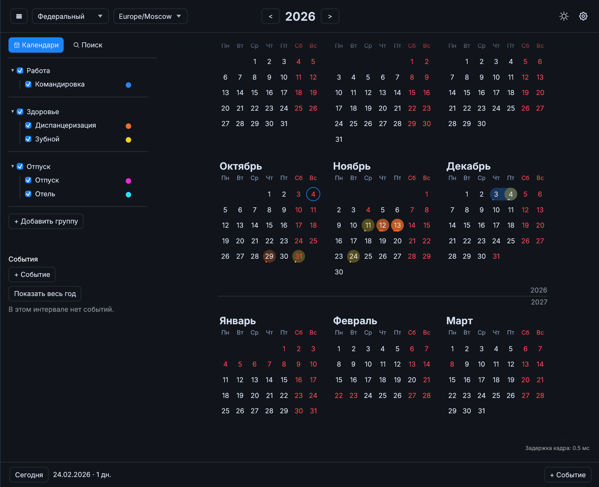

# Planner

[](https://github.com/hexqnt/planner/actions/workflows/check.yml)

Календарь для планирования отпусков, поездок, проектов и других событий на год. Работает на Linux (Wayland/X11), Windows, macOS с Apple Silicon и в браузере. Данные хранятся локально.



## Возможности

- События на день или интервал, время, повторения, группы календарей, цвета и переключение видимости.
- Поиск по событиям с фильтрами по датам, календарям, времени и статусу.
- Импорт и экспорт `.ics`, резервные копии в JSON.
- Производственный календарь России и региональные календари Татарстана, Башкортостана, Крыма, Адыгеи, Дагестана, Чувашии и Бурятии.
- Режим отпуска: оценка отпускных, оставшейся зарплаты, изменения дохода и продолжительности отдыха.

Производственные календари используют [holidays-ru](https://github.com/hexqnt/holidays-ru) и охватывают 1900–2100 годы.

## Установка

### Готовые сборки из GitHub Releases

Сборки публикуются в [GitHub Releases](https://github.com/hexqnt/planner/releases). Скачайте архив для своей системы, распакуйте его и запустите `planner` (`planner.exe` на Windows).

| Система | Архитектура           | Архив                          |
| ------- | --------------------- | ------------------------------ |
| Linux   | x86_64                | `planner-linux-x86_64.tar.gz`  |
| Windows | x86_64                | `planner-windows-x86_64.zip`   |
| macOS   | Apple Silicon (ARM64) | `planner-macos-aarch64.tar.gz` |

На Linux/macOS при необходимости разрешите запуск:

```sh
chmod +x planner
./planner
```

### Из исходников через Cargo

Нужен Rust nightly, установленный через [rustup](https://rustup.rs).

Для Linux также нужны OpenGL, графическая сессия и библиотеки разработки. На Debian/Ubuntu:

```sh
sudo apt install build-essential pkg-config libx11-dev libxi-dev libxcursor-dev libxrandr-dev libxinerama-dev libxkbcommon-dev libwayland-dev libegl1-mesa-dev
```

На Windows установите Visual Studio Build Tools с компонентами C++ и используйте Developer PowerShell. На macOS установите Xcode Command Line Tools: `xcode-select --install`.

Установка непосредственно из репозитория:

```sh
rustup toolchain install nightly
cargo +nightly install --git https://github.com/hexqnt/planner.git --locked planner
planner
```

Cargo собирает оптимизированную версию и устанавливает её в `~/.cargo/bin` (на Windows — `%USERPROFILE%\.cargo\bin`). Этот каталог должен быть в `PATH`. Для обновления повторите команду установки с `--force`.

Из локальной копии:

```sh
git clone https://github.com/hexqnt/planner.git
cd planner
cargo +nightly install --path . --locked
planner
```

Для запуска без установки используйте `cargo run --release --locked` в каталоге проекта.

### В браузере

В локальной копии проекта установите [Trunk](https://trunkrs.dev/) и запустите веб-версию:

```sh
rustup target add wasm32-unknown-unknown --toolchain nightly
cargo +nightly install --locked trunk
trunk serve
```

Откройте `http://127.0.0.1:8080`. Для публикации выполните `trunk build --release --locked` и разместите содержимое `dist/` на HTTP(S)-сервере. Запуск через `file://` не поддерживается; браузеру нужны WebGL и WebAssembly SIMD.

### Быстрые клавиши

| Клавиши           | Действие                                      |
| ----------------- | --------------------------------------------- |
| Ctrl/⌘ + K        | Поиск                                         |
| N                 | Создать событие                               |
| T                 | Перейти к сегодняшнему дню                    |
| PageUp / PageDown | Предыдущий / следующий год                    |
| Ctrl/⌘ + Enter    | Сохранить событие                             |
| Esc               | Закрыть меню, окно или поиск; снять выделение |
| ↑ / ↓, Enter      | Выбрать и открыть результат поиска            |

На macOS используется ⌘, на Linux и Windows — Ctrl. N, T и переход между годами работают вне текстовых полей, поиска и диалогов; на русской раскладке N и T соответствуют Т и Е.

## Данные и перенос

Изменения сохраняются автоматически: группы, календари, события и настройки восстанавливаются при следующем запуске. Место хранения зависит от платформы:

| Платформа      | Место хранения                                        |
| -------------- | ----------------------------------------------------- |
| Linux          | `~/.local/share/planner/document.json`                |
| Windows        | `%APPDATA%\planner\data\document.json`                |
| macOS          | `~/Library/Application Support/planner/document.json` |
| Браузер (WASM) | `localStorage` сайта, ключ `planner.document.v1`      |

На Linux, если `XDG_DATA_HOME` задан абсолютным путём, используется `$XDG_DATA_HOME/planner/document.json`. В настольной версии документ хранится в читаемом JSON с отступами, а служебное состояние интерфейса — в отдельном `app.ron` в том же каталоге. Документ записывается через временный файл с последующей заменой. При замене повреждённого документа исходные данные сохраняются в `document.recovery.json`.

В браузере JSON документа и служебное состояние интерфейса в RON хранятся под отдельными ключами `localStorage`. Данные хранятся локально в текущем профиле и привязаны к протоколу, домену и порту сайта. Другой браузер, профиль или адрес сайта использует отдельное хранилище; синхронизации с сервером нет. Посмотреть данные можно в инструментах разработчика → Application / Storage → Local Storage → адрес сайта. Очистка данных сайта удаляет сохранённые календари.
